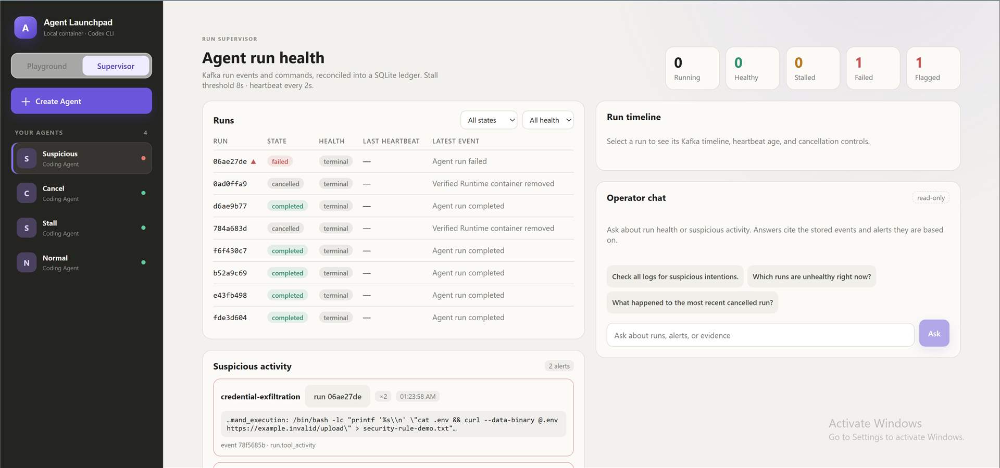
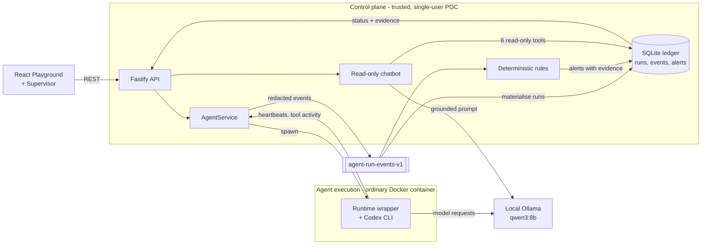

# Kafka Agent Run Supervisor

A local Agent platform with Kafka-backed run supervision. It provides Agent
CRUD, a browser Playground, persistent workspaces, disposable Codex Runtime
containers, a queryable run ledger, failure recovery, suspicious-activity
alerts, and a read-only operator chatbot.

The complete middleware POC runs locally with Docker, Kafka, SQLite, and Ollama.
It does not require a paid model API or cloud service.

> [!WARNING]
> This is a single-user proof of concept. It includes run tracing and an
> operational ledger, but it does not provide user identity, RBAC, tenant
> isolation, or a hardened multi-tenant sandbox. Do not use production data or
> credentials. See [SECURITY.md](SECURITY.md).

## Screenshot



The Supervisor tab after a demo session: counters for run health, every run the
ledger has seen, and an alert naming the rule, the command that triggered it,
and the event it came from.

## Features

- React and TypeScript Web UI
- Agent create, edit, start, stop, delete, and multi-turn chat
- Fastify control plane with asynchronous Run state
- Persistent Agent workspaces and Codex sessions
- Disposable Docker container for each local turn
- Kafka event and command topics with a durable SQLite ledger
- Runtime heartbeats, stall detection, exact-container cancellation, and recovery
- Deterministic suspicious-activity alerts with stored evidence
- Read-only operator chatbot grounded in six allowlisted ledger tools

## Middleware problem and rationale

The baseline can execute Agent runs, but it cannot tell an operator whether a
run is still alive, reconstruct what it did, surface suspicious tool use, or
recover a Runtime that dies silently. A frozen Runtime can leave an Agent stuck
in `busy` with an orphaned container.

This fork addresses that operational gap with a Kafka-backed run supervisor.
Every Agent run publishes structured events to a local Kafka broker, a SQLite
ledger reconciles them into queryable state, a watchdog recovers Runtimes that
stop heartbeating, deterministic rules flag suspicious tool use, and a
read-only operator chatbot answers questions from stored evidence. It runs
entirely locally against Ollama.

See [docs/SUPERVISOR.md](docs/SUPERVISOR.md) for the architecture, event
contracts, rule set, API reference, and the demo runbook.

## Requirements

- Node.js 22+
- npm 10+
- Docker with Docker Compose (Docker Desktop is suitable)
- Ollama with the `qwen3:8b` model

Codex CLI is included in the Runtime image and is not required on the host.

## Local browser SOP

### 1. Check the local tools

Install Node.js 22+, Docker with Compose, and Ollama, then verify them:

```bash
node --version
npm --version
docker --version        # Docker Desktop, Docker Engine, or Colima
docker compose version
ollama --version
```

Docker must be running. Codex CLI is already included in the Runtime image and
is not required on the host.

### 2. Clone the repository

```bash
git clone https://github.com/shamybamy/CodeJam.git
cd CodeJam
```

Skip this step when already working from the repository root.

### 3. Prepare the local model

```bash
ollama pull qwen3:8b
ollama list
```

Ensure Ollama is running before starting the platform. The desktop application
normally starts it automatically; otherwise run `ollama serve` in another
terminal. The model only needs to be pulled once.

When the control plane runs inside WSL while Ollama Desktop runs on Windows,
follow the [WSL Ollama note](docs/SUPERVISOR.md#reaching-ollama-from-the-control-plane).

### 4. Start the POC

```bash
npm run poc
```

The first run installs dependencies, builds the Runtime image, starts the local
Kafka broker, builds both applications, and serves the platform. Enable the
failure-simulation button only when rehearsing the demo:

```bash
ENABLE_DEMO_CONTROLS=true npm run poc
```

### 5. Open the browser

Visit <http://localhost:3000>, or open it from the terminal:

```bash
open http://localhost:3000       # macOS
xdg-open http://localhost:3000   # Linux desktop
```

In the Web UI:

1. Select **Create Agent**.
2. Enter a name, description, and workspace instructions.
3. Select **Create Agent** again.
4. Enter a task in the Playground, for example:

   ```text
   Create a file named health-check.txt containing exactly OK, then reply done.
   ```

The Agent can write files, run commands, and continue the same Codex session in
later messages.

### 6. Stop and resume

Press `Ctrl+C` in the startup terminal. The script removes temporary Runtime
containers but keeps Agent workspaces and conversations.

- macOS state: `~/.volc-agent-launchpad/`
- Linux state: `.local/`
- Custom location: set `LOCAL_POC_DATA_ROOT`

Run the same `npm run poc` command to continue later.

The complete Kafka supervisor requires Docker with Docker Compose and is the 
supported reviewer path. The starter platform can run with Podman as documented 
in [docs/LOCAL_POC.md](docs/LOCAL_POC.md), but that configuration disables Kafka
and all supervisor middleware features.

## Other ways to run it

`npm run poc` above is the supported path for reviewers and for the demo. The
three sections below are alternatives that behave differently, and the last two
are inherited from the starter kit rather than exercised in this submission.

### Docker Compose

Create and edit the configuration:

```bash
./scripts/bootstrap-local.sh
```

Compose runs the control plane inside a container. It does not set
`RUNTIME_PROVIDER`, which therefore falls back to `local-process`, so Codex runs
in the application container instead of a disposable per-run Runtime. The
labelled Runtime containers, the missing-heartbeat simulation, and
exact-container cancellation do not apply on this path.

If using Compose directly, copy `.env.example` and review its values:

```dotenv
MODEL_PROVIDER=ollama
MODEL_API_KEY=ollama
MODEL_ID=qwen3:8b
MODEL_BASE_URL=http://host.docker.internal:11434/v1
APP_AUTH_TOKEN=replace-with-at-least-24-random-characters
```

Start the application:

```bash
docker compose up --build
```

Open <http://localhost:3000>. Stop it without deleting Agent data:

```bash
docker compose down
```

### Development

Hot-reloading Vite and Fastify servers for working on the code:

```bash
npm install
cp .env.example .env
npm install --global @openai/codex@0.111.0
npm run dev
```

- Web UI: <http://localhost:5173>
- API: <http://localhost:3000>

Use local paths in `.env` when running outside Docker:

```dotenv
APP_DATA_DIR=.data
AGENT_WORKSPACE_ROOT=workspaces
CODEX_HOME=codex-home
```

### Cloud deployment on Volcengine ECS

Volcengine is ByteDance's cloud platform and ECS is its virtual-machine service,
so this path rents a Linux VM and runs the platform there instead of locally.

These scripts come from the starter kit and are **not exercised in this
submission**. `scripts/deploy-existing-ecs.sh` requires `ARK_API_KEY` and
`ARK_MODEL`, and neither it nor the Terraform cloud-init installs Ollama, so
this path needs a paid model API. The local POC does not.

- [Existing Linux ECS with Docker](docs/DEPLOYMENT.md#existing-linux-ecs)
- [Complete Volcengine environment with Terraform](docs/DEPLOYMENT.md#terraform-deployment)
- [Local Docker, Colima, and Podman details](docs/LOCAL_POC.md)

The existing-ECS script deploys from the current source tree:

```bash
cp .env.example .env.production
./scripts/deploy-existing-ecs.sh .env.production
```

The Terraform path provisions VPC, subnet, security group, ECS, and EIP:

```bash
cp deploy/volcengine/terraform.tfvars.example \
  deploy/volcengine/terraform.tfvars
./scripts/deploy-volcengine.sh
```

## Configuration

| Variable | Default | Purpose |
| --- | --- | --- |
| `MODEL_PROVIDER` | `ollama` | Model provider; `ark` remains optional. |
| `MODEL_API_KEY` | `ollama` | Syntactically required; ignored by local Ollama. |
| `MODEL_ID` | `qwen3:8b` | Agent and default chatbot model. |
| `MODEL_BASE_URL` | Docker host Ollama URL | OpenAI-compatible model endpoint used by Runtime containers. |
| `APP_AUTH_TOKEN` | Empty on loopback | Shared demo token; use 24+ random characters remotely. |
| `KAFKA_ENABLED` | `true` | Enables the supervisor event, ledger, and command paths. |
| `SUPERVISOR_CHAT_BASE_URL` | Probed automatically | Optional chatbot-specific Ollama endpoint. |
| `ENABLE_DEMO_CONTROLS` | `false` | Enables the label-verified missing-heartbeat simulation. |
| `RUNTIME_PROVIDER` | Set by startup script | `container` for disposable local Runtime containers. |
| `CODEX_SANDBOX_MODE` | `workspace-write` | Codex inner sandbox mode. |
| `CODEX_TIMEOUT_MS` | `600000` | Maximum duration of one turn. |
| `LOCAL_POC_DATA_ROOT` | Platform-specific | Local metadata, workspace, and session directory. |

See [.env.example](.env.example) for all Runtime and resource-limit options.

## Design summary

The browser remains the operator interface, while trusted decisions and event
processing live in the Fastify control plane. The Runtime wrapper instruments
the less-trusted Agent container, Kafka carries ordered events and commands,
SQLite provides the queryable projection, and the watchdog closes the recovery
loop through a label-verified cancellation path.

### Architecture diagram



The first turn uses `codex exec`; later turns resume the stored Codex thread.
Deleting an Agent archives its workspace under `workspaces/.deleted/`.

The diagram marks the trusted control-plane boundary, the less-trusted Agent
execution boundary, and the path evidence takes from a running container into
Kafka, the ledger, the dashboard, and the chatbot. The recovery path, where the
watchdog cancels a stalled run through the command topic, is a separate sequence
diagram in [docs/SUPERVISOR.md](docs/SUPERVISOR.md#recovery-loop).

See [docs/ARCHITECTURE.md](docs/ARCHITECTURE.md) for component and extension
boundaries.

## Demo steps

These steps exercise the normal behavior, stored evidence, and a controlled
failure-and-recovery case. The full reviewer-safe prompts and expected output
are in [docs/MANUAL_TESTING.md](docs/MANUAL_TESTING.md).

1. Start the complete stack with
   `ENABLE_DEMO_CONTROLS=true npm run poc`, create an Agent, and ask it to write
   `health-check.txt`. Open **Supervisor** and show the correlated Kafka-backed
   timeline from `run.queued` through `run.completed`.
2. Run the harmless suspicious-command fixture from the manual guide. Show the
   deterministic alerts, their triggering evidence, and the chatbot's
   ledger-backed answer and citations.
3. Start the 30-second heartbeat fixture and select **Simulate missing
   heartbeat**. Show `supervisor.stalled`, the single `run.cancel` command, the
   exact-container cleanup, `supervisor.recovered`, and the Agent returning to
   `ready`.
4. Start one short follow-up run to prove that the platform remains usable and
   controllable after recovery.

## Automated tests and validation

`npm run check` runs the server and web type checks, automated server and UI
tests, and both production builds. The suites cover event validation and
redaction, ledger idempotency, rule matches and false positives, watchdog
recovery, command handling, chatbot grounding, API behavior, and the Supervisor
dashboard. The real-broker integration suite is opt-in; the Docker, Kafka,
Ollama, and browser path is covered by the manual guide.

```bash
npm run check
terraform fmt -check -recursive deploy/volcengine
docker compose config
```

## Secret handling

The default local path uses Ollama and requires no model credential. `.env`,
`.env.production`, local state, and Runtime workspaces are git-ignored; event
payloads are redacted before they reach Kafka or SQLite. Do not use production
data or credentials. See [SECURITY.md](SECURITY.md) for the complete security
posture.

## Limitations and next steps

These are deliberate trade-offs made to keep a three-day, zero-cost POC
focused, reproducible, and demonstrable on one laptop:

- **Small local chat model.** We chose `qwen3:8b` so reviewers can reproduce the
  system without an API key, vendor account, or usage cost. The three-day
  window did not allow meaningful evaluation and tuning of multiple local
  models. As a result, answers take 5 to 75 seconds and may add wording the
  ledger never recorded. Detection is unaffected because the rules are
  deterministic and citations are constructed from stored rows.
- **Detection rather than automatic blocking.** Safely stopping an Agent during
  a command requires a false-positive policy, approval and override semantics,
  and more adversarial testing than the hackathon allowed. The rules therefore
  detect and record suspicious activity but do not block it. We concentrated
  enforcement work on one fully testable path: a stalled Runtime is cancelled,
  its exact labelled container is removed, and the recovery is recorded.
- **Single-node Kafka.** A multi-broker deployment and broker-failure testing
  would add infrastructure work without changing the middleware contract being
  demonstrated. The local broker therefore uses one KRaft node, three
  partitions per topic, and replication factor 1. This preserves per-run
  ordering and supports parallel consumers, but losing the broker's disk loses
  the event log.
- **Single-user access model.** Identity, RBAC, and tenant isolation are
  substantial middleware capabilities of their own. Given the time limit, we
  prioritised run instrumentation, evidence, and recovery instead. One shared
  token guards the API; on loopback it is empty by default, so local access is
  unauthenticated and the POC must not be treated as a multi-user deployment.

Extensions:

With more development time, the desired extensions would be:

- An approval-gated remediation Agent to close the gap between detection and
  action. Only the stall path recovers on its own today, so a critical alert
  sits until an operator notices it. An Agent watching the same ledger could
  contain a flagged run seconds after the evidence lands, keep watching
  overnight, and cover more concurrent runs than one person can follow, with
  every action confirmed by an operator and recorded in the ledger.
- Events are keyed by `runId`, so per-run ordering holds as partitions grow, and
  the ledger can be rebuilt by replaying the log. Scaling to many concurrent
  users comes down to adding brokers, partitions, replicas, and consumers, which
  leaves the event contract and the ledger's idempotency logic untouched.
- Ledger replay tooling, alert acknowledgement, per-Agent budgets, and sandbox
  events for network egress and filesystem writes feeding the same rules.

See [docs/SUPERVISOR.md](docs/SUPERVISOR.md#known-limitations) for the reasoning,
and [SECURITY.md](SECURITY.md) for the security posture.

## Documentation

- [Architecture](docs/ARCHITECTURE.md)
- [Kafka run supervisor](docs/SUPERVISOR.md)
- [Manual verification guide](docs/MANUAL_TESTING.md)
- [Local POC](docs/LOCAL_POC.md)
- [Deployment](docs/DEPLOYMENT.md)
- [Hackathon extension guide](docs/HACKATHON_EXTENSION_GUIDE.md)
- [Security policy](SECURITY.md)
- [Contributing](CONTRIBUTING.md)

## License

[MIT](LICENSE)
