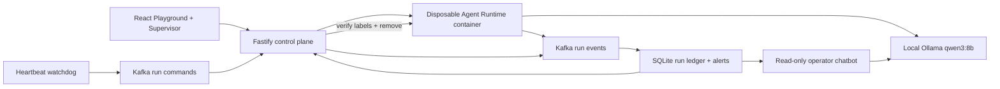

# Kafka Agent Run Supervisor

A local Agent platform with Kafka-backed run supervision. It provides Agent
CRUD, a browser Playground, persistent workspaces, disposable Codex Runtime
containers, a queryable run ledger, failure recovery, suspicious-activity
alerts, and a read-only operator chatbot.

The complete middleware POC runs locally with Docker, Kafka, SQLite, and Ollama.
It does not require a paid model API or cloud service.

> [!WARNING]
> This is a single-user proof of concept. It includes run tracing and an
> operational ledger, but it does not provide user identity, RBAC, tenant
> isolation, or a hardened multi-tenant sandbox. Do not use production data or
> credentials. See [SECURITY.md](SECURITY.md).

## Screenshots

### Agent Playground


### Create an Agent


## Features

- React and TypeScript Web UI
- Agent create, edit, start, stop, delete, and multi-turn chat
- Fastify control plane with asynchronous Run state
- Persistent Agent workspaces and Codex sessions
- Disposable Docker container for each local turn
- Kafka event and command topics with a durable SQLite ledger
- Runtime heartbeats, stall detection, exact-container cancellation, and recovery
- Deterministic suspicious-activity alerts with stored evidence
- Read-only operator chatbot grounded in six allowlisted ledger tools

## Run supervisor middleware

This fork adds a Kafka-backed run supervisor on top of the baseline platform:
every Agent run publishes structured events to a local Kafka broker, a SQLite
ledger reconciles them into queryable run state, a watchdog recovers Runtimes
that stop heartbeating, deterministic rules flag suspicious tool use, and a
read-only operator chatbot answers questions from the stored evidence. It runs
entirely locally against Ollama, with no paid service.

See [docs/SUPERVISOR.md](docs/SUPERVISOR.md) for the architecture, event
contracts, rule set, API reference, and the demo runbook.

## Requirements

- Node.js 22+
- npm 10+
- Docker with Docker Compose (Docker Desktop is suitable)
- Ollama with the `qwen3:8b` model

Codex CLI is included in the Runtime image and is not required on the host.

## Local browser SOP

### 1. Check the local tools

Install Node.js 22+, Docker with Compose, and Ollama, then verify them:

```bash
node --version
npm --version
docker --version        # Docker Desktop, Docker Engine, or Colima
docker compose version
ollama --version
```

Docker must be running. Codex CLI is already included in the Runtime image and
is not required on the host.

### 2. Clone the repository

```bash
git clone https://github.com/shamybamy/CodeJam.git
cd CodeJam
```

Skip this step when already working from the repository root.

### 3. Prepare the local model

```bash
ollama pull qwen3:8b
ollama list
```

Ensure Ollama is running before starting the platform. The desktop application
normally starts it automatically; otherwise run `ollama serve` in another
terminal. The model only needs to be pulled once.

When the control plane runs inside WSL while Ollama Desktop runs on Windows,
follow the [WSL Ollama note](docs/SUPERVISOR.md#reaching-ollama-from-the-control-plane).

### 4. Start the POC

```bash
npm run poc
```

The first run installs dependencies, builds the Runtime image, starts the local
Kafka broker, builds both applications, and serves the platform. Enable the
failure-simulation button only when rehearsing the demo:

```bash
ENABLE_DEMO_CONTROLS=true npm run poc
```

### 5. Open the browser

Visit <http://localhost:3000>, or open it from the terminal:

```bash
open http://localhost:3000       # macOS
xdg-open http://localhost:3000   # Linux desktop
```

In the Web UI:

1. Select **Create Agent**.
2. Enter a name, description, and workspace instructions.
3. Select **Create Agent** again.
4. Enter a task in the Playground, for example:

   ```text
   Create a TypeScript hello-world CLI, add a test, and run it.
   ```

The Agent can write files, run commands, and continue the same Codex session in
later messages.

### 6. Stop and resume

Press `Ctrl+C` in the startup terminal. The script removes temporary Runtime
containers but keeps Agent workspaces and conversations.

- macOS state: `~/.volc-agent-launchpad/`
- Linux state: `.local/`
- Custom location: set `LOCAL_POC_DATA_ROOT`

Run the same `npm run poc` command to continue later.

The Kafka supervisor requires Docker Compose. A baseline-only Podman path is
documented in [docs/LOCAL_POC.md](docs/LOCAL_POC.md), but it disables the
middleware and is not the reviewer path.

## Docker Compose

Create and edit the configuration:

```bash
./scripts/bootstrap-local.sh
```

The Compose deployment path is retained from the starter repository. For local
review, prefer `npm run poc`. If using Compose directly, copy `.env.example` and
review its values:

```dotenv
MODEL_PROVIDER=ollama
MODEL_API_KEY=ollama
MODEL_ID=qwen3:8b
MODEL_BASE_URL=http://host.docker.internal:11434/v1
APP_AUTH_TOKEN=replace-with-at-least-24-random-characters
```

Start the application:

```bash
docker compose up --build
```

Open <http://localhost:3000>. Stop it without deleting Agent data:

```bash
docker compose down
```

## Development

```bash
npm install
cp .env.example .env
npm install --global @openai/codex@0.111.0
npm run dev
```

- Web UI: <http://localhost:5173>
- API: <http://localhost:3000>

Use local paths in `.env` when running outside Docker:

```dotenv
APP_DATA_DIR=.data
AGENT_WORKSPACE_ROOT=workspaces
CODEX_HOME=codex-home
```

## Deployment

- [Existing Linux ECS with Docker](docs/DEPLOYMENT.md#existing-linux-ecs)
- [Complete Volcengine environment with Terraform](docs/DEPLOYMENT.md#terraform-deployment)
- [Local Docker, Colima, and Podman details](docs/LOCAL_POC.md)

The existing-ECS script deploys from the current source tree:

```bash
cp .env.example .env.production
./scripts/deploy-existing-ecs.sh .env.production
```

The Terraform path provisions VPC, subnet, security group, ECS, and EIP:

```bash
cp deploy/volcengine/terraform.tfvars.example \
  deploy/volcengine/terraform.tfvars
./scripts/deploy-volcengine.sh
```

## Configuration

| Variable | Default | Purpose |
| --- | --- | --- |
| `MODEL_PROVIDER` | `ollama` | Model provider; `ark` remains optional. |
| `MODEL_API_KEY` | `ollama` | Syntactically required; ignored by local Ollama. |
| `MODEL_ID` | `qwen3:8b` | Agent and default chatbot model. |
| `MODEL_BASE_URL` | Docker host Ollama URL | OpenAI-compatible model endpoint used by Runtime containers. |
| `APP_AUTH_TOKEN` | Empty on loopback | Shared demo token; use 24+ random characters remotely. |
| `KAFKA_ENABLED` | `true` | Enables the supervisor event, ledger, and command paths. |
| `SUPERVISOR_CHAT_BASE_URL` | Probed automatically | Optional chatbot-specific Ollama endpoint. |
| `ENABLE_DEMO_CONTROLS` | `false` | Enables the label-verified missing-heartbeat simulation. |
| `RUNTIME_PROVIDER` | Set by startup script | `container` for disposable local Runtime containers. |
| `CODEX_SANDBOX_MODE` | `workspace-write` | Codex inner sandbox mode. |
| `CODEX_TIMEOUT_MS` | `600000` | Maximum duration of one turn. |
| `LOCAL_POC_DATA_ROOT` | Platform-specific | Local metadata, workspace, and session directory. |

See [.env.example](.env.example) for all Runtime and resource-limit options.

## How it works



The first turn uses `codex exec`; later turns resume the stored Codex thread.
Deleting an Agent archives its workspace under `workspaces/.deleted/`.

See [docs/ARCHITECTURE.md](docs/ARCHITECTURE.md) for component and extension
boundaries.

## Validation

```bash
npm run check
terraform fmt -check -recursive deploy/volcengine
docker compose config
```

## Limitations and next steps

Trade-offs made for a three-day, zero-cost POC:

- The chatbot runs on a local `qwen3:8b`, so the system reproduces without an
  API key. Answers take 5 to 75 seconds and the model sometimes adds wording the
  ledger never recorded. Detection is unaffected, since the rules are
  deterministic and citations come from stored rows.
- The rules detect and record and don't block. Containment and cleanup are
  shown on the reliability path, where a stalled Runtime is cancelled and its
  container removed.
- The broker runs as a single Kafka node, and each topic has three partitions
  with one copy of each. That is enough for per-run ordering and parallel
  consumers, but losing the broker's disk loses the event log.
- There are no user accounts. One shared token guards the API, and on loopback
  it is empty by default, so local access is unauthenticated.

Next:

- An approval-gated remediation Agent would close the gap between detection and
  action. Only the stall path recovers on its own today, so a critical alert
  sits until an operator notices it. An Agent watching the same ledger could
  contain a flagged run seconds after the evidence lands, keep watching
  overnight, and cover more concurrent runs than one person can follow, with
  every action confirmed by an operator and recorded in the ledger.
- Events are keyed by `runId`, so per-run ordering holds as partitions grow, and
  the ledger can be rebuilt by replaying the log. Scaling to many concurrent
  users comes down to adding brokers, partitions, replicas, and consumers, which
  leaves the event contract and the ledger's idempotency logic untouched.
- Ledger replay tooling, alert acknowledgement, per-Agent budgets, and sandbox
  events for network egress and filesystem writes feeding the same rules.

See [docs/SUPERVISOR.md](docs/SUPERVISOR.md#known-limitations) for the reasoning,
and [SECURITY.md](SECURITY.md) for the security posture.

## Documentation

- [Architecture](docs/ARCHITECTURE.md)
- [Kafka run supervisor](docs/SUPERVISOR.md)
- [Manual verification guide](docs/MANUAL_TESTING.md)
- [Local POC](docs/LOCAL_POC.md)
- [Deployment](docs/DEPLOYMENT.md)
- [Hackathon extension guide](docs/HACKATHON_EXTENSION_GUIDE.md)
- [Security policy](SECURITY.md)
- [Contributing](CONTRIBUTING.md)

## License

[MIT](LICENSE)
