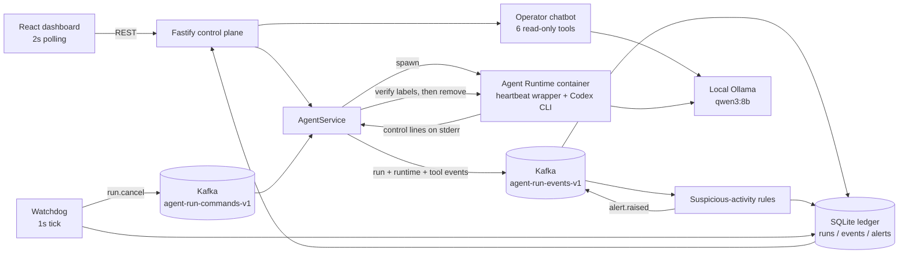

# Kafka Run Supervisor

The middleware capability added to the starter kit: every Agent run emits
structured events to Kafka, a SQLite ledger reconciles them into queryable run
state, a watchdog detects Runtimes that stop heartbeating and recovers them, a
deterministic rule set flags suspicious tool use, and a read-only operator
chatbot answers questions from the stored evidence.

Nothing here requires a paid service. Kafka runs locally in KRaft mode, the
ledger is a local SQLite file, and both the Agent and the chatbot use a local
Ollama model.

## Why

The baseline platform can start an Agent run, but it cannot answer the questions
an operator actually has: is this run alive, what did it do, did it try
something it should not have, and what happens when its Runtime dies quietly? A
crashed or frozen Runtime leaves the Agent stuck in `busy` forever with an
orphaned container behind it. The supervisor makes run health observable and
recoverable, and it does so from evidence rather than from guesswork.

## Architecture



Both topics are keyed by `runId`, so every event and command for one run stays
in order on one partition.

## Event and command contracts

`apps/server/src/supervisor-contracts.ts` owns both schemas; they are validated
with Zod on the way in and on the way out of Kafka.

```ts
{
  schemaVersion: 1,
  eventId: string,        // UUID, the idempotency key for the ledger
  type: SupervisorEventType,
  occurredAt: string,     // ISO 8601 with offset
  runId: string,
  agentId: string,
  runtimeInstanceId?: string,
  source: "control-plane" | "runtime" | "supervisor" | "operator",
  severity: "info" | "warning" | "critical",
  summary: string,
  payload: Record<string, unknown>
}
```

Event types: `run.queued`, `run.started`, `runtime.heartbeat`,
`runtime.exited`, `run.tool_activity`, `run.completed`, `run.failed`,
`run.cancelled`, `supervisor.stalled`, `supervisor.demo_paused`,
`alert.raised`, `supervisor.recovered`.

Commands are `run.cancel` only, carrying `commandId`, `runId`, `agentId`,
`runtimeInstanceId`, `source` (`supervisor` or `operator`), and `reason`.

Every event passes through `supervisor-redaction.ts` before it reaches Kafka or
SQLite: keys that look like credentials are replaced, and bearer tokens and
`sk-`/`key-`/`token-` style values are stripped from free text.

## Ledger

`supervisor-ledger.ts`, SQLite in WAL mode:

| Table | Purpose |
|---|---|
| `runs` | Materialised run state: `state`, `health`, `startedAt`, `lastHeartbeatAt`, `endedAt` |
| `events` | Every event, unique on `eventId` and on `(topic, partition, offset)` |
| `alerts` | Suspicious-activity alerts with rule, severity, evidence, and the triggering event |
| `processed_commands` | Command idempotency |
| `command_outbox` | Commands awaiting publication, with attempts and backoff |

Ingestion is idempotent twice over: `INSERT OR IGNORE` on `eventId` means a
replayed Kafka partition cannot duplicate an event, and run state only moves
forward (`WHERE excluded.last_event_at >= runs.last_event_at`), so an
out-of-order delivery cannot resurrect a finished run.

## Heartbeat, stall detection, and recovery

`runtime/agent-runtime-wrapper.mjs` runs inside the Runtime container. It starts
Codex as a child process and writes a private control line to stderr every two
seconds:

```
__CODEJAM_RUNTIME_EVENT__{"type":"runtime.heartbeat",...}
```

The control plane intercepts those lines, keeps them out of user-visible output,
and republishes them as `runtime.heartbeat` events. Because the heartbeat
process lives inside the container, freezing the container genuinely stops it.

The watchdog ticks once per second:

1. `claimStalledRuns` atomically finds runs whose last heartbeat is older than
   `SUPERVISOR_STALL_AFTER_MS`, writes one `supervisor.stalled` event, flips the
   run to `health = stalled`, and queues exactly one `run.cancel` in the outbox
   — all in one `BEGIN IMMEDIATE` transaction, so a second tick cannot claim the
   same run.
2. Pending outbox commands are published to Kafka, with exponential backoff on
   failure.
3. The command consumer verifies `runtimeInstanceId`, then the container's
   `io.codejam.*` labels, and only then force-removes that exact container.
4. `supervisor.recovered` records whether a container was actually removed, and
   the Agent returns to `ready`.

Commands addressed to another Runtime instance are ignored rather than retried,
and a command that keeps failing is abandoned after five attempts — otherwise
one bad message would block every later cancellation on that partition.

## Suspicious-activity rules

`supervisor-rules.ts`. Rules classify; they never block. Detection is
deterministic so it is testable, and so the chatbot explains evidence instead of
inventing a classification.

| Rule | Severity | Catches |
|---|---|---|
| `secret-file-access` | critical | Reading `.env`, `.aws/credentials`, `.ssh/id_*`, `/etc/shadow`, `.git-credentials`, `.kube/config` |
| `destructive-filesystem` | critical | `rm -rf /`, `mkfs`, `dd of=/dev/sd*`, `chmod -R 777 /`, fork bombs |
| `credential-exfiltration` | critical | Piping env or key material into `curl`/`nc`/`scp`, uploads to paste and webhook hosts |
| `privilege-escalation` | critical | Docker socket access, `--privileged`, `nsenter`, `chroot /host`, `sudo su` |
| `unexpected-package-execution` | warning | Remote scripts piped into a shell |

Rules are evaluated against the event summary and the `command`, `detail`,
`reason`, and `output` payload fields of newly stored events, after redaction.
`alert.raised` events are never themselves scored — otherwise an alert's
evidence would trigger the rule that produced it.

Alert IDs are `sha256(ruleId + runId + evidence)`. Keying on the event alone
would be replay-safe but noisy: Codex reports a command at start and at
completion, and Agents retry, so one behaviour raised four near-identical
alerts. Grouping by evidence collapses those into one alert per rule that counts
its `occurrences`, records `lastSeenAt`, and cites the event that triggered it
first. A real run of `cat .env && curl --data-binary @.env …` produces exactly
two alerts — `secret-file-access` and `credential-exfiltration` — each with
`occurrences: 4`.

Evidence for these rules arrives as `run.tool_activity` events, parsed from
Codex `item.started` / `item.completed` output: `command_execution` (with exit
code and aggregated output), `file_change`, `mcp_tool_call`, and `web_search`.
Commands are reported at start as well as completion, so a run frozen
mid-command still leaves evidence of what it was doing.

## Operator chatbot

`supervisor-chat.ts` is an isolated Fastify plugin. It has no SQL, shell, Kafka,
or Docker access — only these six read-only tools
(`supervisor-chat-tools.ts`):

`getSystemOverview`, `listRuns`, `getRunTimeline`, `searchEvents`,
`listAlerts`, `getRunHealth`.

One question runs in two model calls:

1. Tool selection. The model is offered the six tool schemas. Every returned
   call is checked against the allowlist and parsed with its Zod schema, and
   anything else is discarded. If the model names no valid tool, or its choices
   return nothing, a deterministic keyword plan runs instead, so a small local
   model cannot leave an answer ungrounded.
2. Answer composition. The gathered evidence goes back as data inside an
   `<<<EVIDENCE … EVIDENCE>>>` block, with no tools offered. Nothing written in
   a log can reach a tool, because at the only point the model sees log text
   there is no tool to call.

Further constraints:

- At most `SUPERVISOR_CHAT_MAX_TOOL_CALLS` (default 3) tool calls per question.
- If every tool comes back empty, the answer is "Not enough evidence…" and the
  model is never asked to compose anything.
- Citations are built from the tool results, not parsed out of the model's text,
  so a citation always points at a row that exists.
- Reasoning blocks are stripped at both the client and the plugin boundary.
- The chatbot is read-only. Cancellation stays a deliberate operator action.

## HTTP API

| Method | Path | Purpose |
|---|---|---|
| GET | `/api/supervisor/overview` | Counters plus watchdog settings |
| GET | `/api/supervisor/runs` | Runs with heartbeat age; `?state=`, `?health=` |
| GET | `/api/supervisor/runs/:runId` | One run plus its alerts |
| GET | `/api/supervisor/runs/:runId/events` | Full run timeline |
| GET | `/api/supervisor/events` | Event search: `?text=`, `?type=`, `?severity=`, `?since=` |
| GET | `/api/supervisor/alerts` | Alerts with evidence and triggering event |
| POST | `/api/supervisor/runs/:runId/cancel` | Publishes an operator `run.cancel`; falls back to the outbox if Kafka is down |
| POST | `/api/supervisor/runs/:runId/simulate-stall` | Demo only; pauses the label-verified container |
| POST | `/api/supervisor/chat` | Operator chatbot |

All of them return 503 while `KAFKA_ENABLED=false`, and `simulate-stall` is not
registered at all unless `ENABLE_DEMO_CONTROLS=true`.

## Configuration

Beyond the baseline variables in `.env.example`:

| Variable | Default | Meaning |
|---|---|---|
| `KAFKA_ENABLED` | `true` | Turns the whole supervisor on or off |
| `KAFKA_BROKERS` | `127.0.0.1:29092` | Broker list |
| `SUPERVISOR_HEARTBEAT_INTERVAL_MS` | `2000` | Runtime heartbeat period |
| `SUPERVISOR_STALL_AFTER_MS` | `8000` | Silence before a run is stalled |
| `SUPERVISOR_WATCHDOG_INTERVAL_MS` | `1000` | Watchdog tick |
| `SUPERVISOR_CHAT_BASE_URL` | probed | OpenAI-compatible endpoint for the chatbot |
| `SUPERVISOR_CHAT_MODEL` | `MODEL_ID` | Chatbot model |
| `SUPERVISOR_CHAT_MAX_TOOL_CALLS` | `3` | Tool budget per question |
| `ENABLE_DEMO_CONTROLS` | `false` | Exposes "Simulate missing heartbeat" |

### Reaching Ollama from the control plane

The Agent Runtime container reaches Ollama at `http://host.docker.internal:11434/v1`.
The control plane is somewhere else, so unless `SUPERVISOR_CHAT_BASE_URL` is
set, the chat client probes `127.0.0.1`, the container alias, and the IPv4
default gateway, then keeps whichever answers.

On Windows with the control plane in WSL there is a wrinkle: a desktop Ollama
listens on `127.0.0.1` only, which the WSL distro cannot reach. Docker
containers still reach it through Docker Desktop's host alias, which is why
Agent runs work while the chatbot cannot connect.

Binding the Windows Ollama to `0.0.0.0` would fix it but exposes port 11434 to
whatever network the machine is on. A safer development setup runs a second
Ollama inside WSL. Install it there using the official Linux instructions, which
keeps the chatbot on a real loopback address:

```bash
ollama serve
# In another WSL terminal:
ollama pull qwen3:8b
```

The Agent Runtime keeps using the Windows Ollama through
`host.docker.internal`; only the control plane's chatbot uses the WSL one. Start
`ollama serve` in WSL before a demo, or the chat panel returns 503 with the list
of addresses it tried.

## Running it

```bash
ENABLE_DEMO_CONTROLS=true npm run poc
```

That builds the Runtime image, starts the Kafka broker via Docker Compose,
builds the web and API bundles, and serves <http://localhost:3000>. `Ctrl+C`
stops the server, removes this instance's Runtime containers, and stops Kafka.

Kafka alone, for development against a host-run control plane:

```bash
docker compose up --detach --wait kafka
```

## Demo runbook

### 1. Normal run

Create an Agent, send a prompt, then open **Supervisor**. The timeline shows
`run.queued → run.started → runtime.heartbeat × N → run.tool_activity →
run.completed`, each row carrying its Kafka topic·partition·offset. Counters
move from Running to Healthy.

### 2. Suspicious activity

Use the harmless quoted-string fixture in `docs/MANUAL_TESTING.md`. It makes the
Agent execute a `printf` command whose data resembles secret access and
exfiltration, without reading a secret or making a network request. The command
evidence is flagged by `secret-file-access` and `credential-exfiltration`, and
the alert panel shows the rule, the matched evidence, and a link to the
triggering event. Ask the chatbot "Check all logs for suspicious intentions" and
it answers from `listAlerts`, citing the run and event.

### 3. Missing heartbeat

With a run in flight, press **Simulate missing heartbeat**. The backend verifies
the container's labels and calls `docker pause`. Heartbeats genuinely stop,
because the heartbeat process is inside that container. After eight seconds the
watchdog writes `supervisor.stalled` and emits exactly one `run.cancel`, the
command consumer verifies the labels and removes that exact container, and
`supervisor.recovered` records the cleanup. Confirm with `docker ps -a --filter
label=io.codejam.launchpad=agent-runtime` that no orphan remains, then start
another run to show the platform still works.

## Tests

```bash
npm run check     # typecheck, tests, build
```

The root check runs both workspaces. The web suite uses Vitest, jsdom, and
Testing Library to cover dashboard loading, counters, filters, timeline and
Kafka-offset rendering, cancellation and demo controls, operator-chat answers
and citations, API authentication, request bodies, and error states. Run it on
its own with `npm run test -w @launchpad/web`, or use
`npm run test:watch -w @launchpad/web` while editing the UI.

The stall path is covered without Docker, Kafka, or tokens:
`supervisor-watchdog.test.ts` drives a fake clock and an in-memory publisher,
asserting exactly one `supervisor.stalled` and one `run.cancel`, and no
duplicates on a later tick. `supervisor-rules.test.ts` covers each rule plus a
false-positive suite of ordinary Agent commands. `supervisor-chat.test.ts`
covers tool allowlisting, the tool budget, the injection boundary, and the
"not enough evidence" path. `supervisor-kafka.integration.test.ts` is skipped
unless a broker is available.

## Known limitations

Trade-offs made for a three-day, zero-cost POC.

The chatbot runs on a local `qwen3:8b` through Ollama, so the system reproduces
without an API key or a vendor account. Answers take 5 to 75 seconds depending
on how many tools a question needs, and the model sometimes adds wording the
ledger never recorded, such as calling an alert a security incident. Only the
prose is affected: the rules are deterministic regex over stored events, and
citations are built from the rows the tools returned rather than parsed out of
the model's text. Set `SUPERVISOR_CHAT_BASE_URL` and `SUPERVISOR_CHAT_MODEL` to
use any OpenAI-compatible endpoint instead.

The rules detect and record but don't block since stopping an Agent mid-command
needs a false-positive policy or user oversight. Containment is shown on the 
reliability path instead, where a stalled Runtime is cancelled and its container 
removed.

The Compose broker is one KRaft node with three partitions at replication factor
1. It survives a restart, not the loss of its disk.

There is no identity, RBAC, or tenant isolation, and every operator shares one
token. `SECURITY.md` covers the security posture.

Commands are addressed by `runtimeInstanceId`, and a control plane ignores those
belonging to another instance. Several control planes can share the topics, but
each Runtime belongs to one of them.

The chat model has to be reachable from the control plane. On Linux and macOS
the default `127.0.0.1` candidate works; a control plane in WSL with Ollama on
Windows needs the step described above.

## Next steps

An approval-gated remediation Agent would close the gap between detection and
action. One failure recovers automatically today, the stalled Runtime. Every
other finding waits for a human to read the dashboard, so the time to contain a
run that trips `credential-exfiltration` is however long it takes someone to
look. An Agent watching the same ledger could quarantine that run seconds after
the evidence lands, keep watching overnight, and cover more concurrent runs than
one operator can follow. It could also act on patterns that no single rule
expresses, such as an Agent that trips the same rule on every run, or one that
has failed five times in a row.

The safety properties carry over. Every action is a command on
`agent-run-commands-v1`, so an Agent's decisions are idempotent, label-verified
before they touch a container, and recorded in the ledger as evidence beside the
alert that prompted them. Operator confirmation still gates anything
destructive; what changes is that the operator arrives to an action already
proposed, with its evidence attached.

For one laptop, a SQLite table and a polling loop would have been simpler. Kafka
was chosen for properties the supervisor already depends on:

- The event topic holds the durable record, and the ledger is a projection of
  it. Every event stores its topic, partition, and offset, so a lost ledger can
  be rebuilt by replaying the topic, and `INSERT OR IGNORE` on `eventId` makes
  that replay safe.
- Events and commands are keyed by `runId`, so one run's events stay ordered on
  one partition while different runs spread across partitions. Partition count
  can grow without breaking that.
- The ledger writer and the command executor are separate consumer groups. A
  metrics sink or an archive attaches as another group without changing the
  control plane.
- A slow or restarted consumer resumes from its committed offset, so events
  queue in the log instead of being dropped.

Serving many concurrent users then comes down to deployment: more brokers,
partitions, replicas, and consumers per group, with the event contract, the
keying, and the ledger's idempotency all unchanged.

Also on the list: replay tooling that rebuilds the ledger from the topic, alert
acknowledgement so an operator can triage a noisy rule, per-Agent budgets in the
same middleware path, and sandbox events for network egress and filesystem
writes feeding the same rules.

## Development notes

- Run repository commands from the cloned repository root.
- Node.js 22+ must be available in the active shell.
- Kafka publishes to `127.0.0.1:29092` for the host-run control plane.
- Local state (ledger, workspaces, and `codex-home`) lives in the git-ignored
  `.local/` directory on Linux by default.
